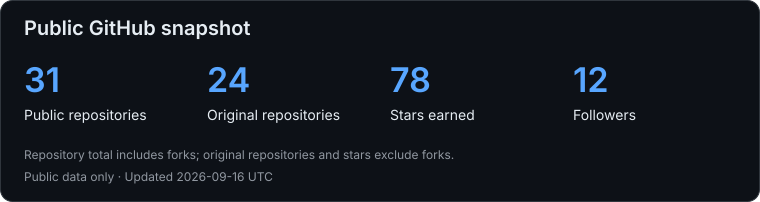
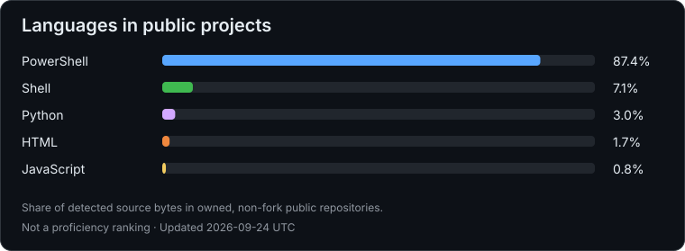

# Emil Wójcik

[English](./README.md) · [Polski](./README.pl.md)

**Staff Engineer | SRE i inżynieria platform**

Buduję niezawodne platformy, rozwijam obserwowalność i automatyzuję pracę inżynierską.

Gdańsk, Polska · [LinkedIn](https://www.linkedin.com/in/emilwojcik/) · [Projekty publiczne](https://github.com/emilwojcik93?tab=repositories)

## Czym się zajmuję

- **Niezawodność i obserwowalność:** metryki, logi, alertowanie, obsługa incydentów i weryfikacja odtwarzania danych.
- **Platformy i wdrożenia:** Kubernetes, Helm, GitOps, współdzielone pipeline’y CI/CD i powtarzalne wdrożenia.
- **Automatyzacja i integracje:** Python, Bash, API i bezpieczne narzędzia Model Context Protocol (MCP).
- **Docs-as-Code:** wersjonowana dokumentacja, diagramy, przeglądy zmian i automatyczna publikacja.

## Technologie

| Obszar | Narzędzia i technologie |
| --- | --- |
| Skryptowanie | Python, Bash, PowerShell |
| Systemy i kontenery | Linux, Windows, WSL, Docker, Kubernetes, Helm |
| Wdrożenia i GitOps | Git, GitLab CI/CD, GitHub Actions, Argo CD |
| Obserwowalność | Prometheus, VictoriaMetrics, Grafana, Alertmanager, Thanos, OpenSearch |
| Dostęp i integracje | OpenBao, TLS, SSO, REST API, MCP |
| Dokumentacja | Markdown, Mermaid, D2, MkDocs |

Dodatkowe doświadczenie: Ansible, Terraform, Proxmox, AWS, Azure i Datadog.

## Wybrane projekty publiczne

| Projekt | Zastosowanie |
| --- | --- |
| [Corporate SSL Manager](https://github.com/emilwojcik93/corporate-ssl-manager) | Konfiguracja certyfikatów i rozwiązywanie problemów w WSL, Node.js i Docker. |
| [PowerShell Profile Manager](https://github.com/emilwojcik93/powershell-profile-manager) | Modułowa konfiguracja powłoki, współdzielone polecenia i integracja MCP. |
| [Windows System Audit](https://github.com/emilwojcik93/windows-system-audit) | Inwentaryzacja sprzętu, sieci, pamięci masowej i zabezpieczeń z wykorzystaniem PowerShell. |
| [WSL & Docker Setup](https://github.com/emilwojcik93/wsl-docker-setup) | Skrypty PowerShell i Bash do tworzenia powtarzalnych środowisk programistycznych. |

Poza pracą nad infrastrukturą publikuję również [narzędzia do gier i poradniki techniczne](https://github.com/emilwojcik93?tab=repositories).

## Statystyki GitHub

<a href="https://github.com/emilwojcik93?tab=repositories">
  <picture>
    <source media="(max-width: 600px)" srcset="./assets/github-stats-mobile.svg" />
    
  </picture>
</a>

<a href="https://github.com/emilwojcik93?tab=repositories">
  <picture>
    <source media="(max-width: 600px)" srcset="./assets/top-languages-mobile.svg" />
    
  </picture>
</a>

Statystyki są aktualizowane codziennie na podstawie publicznych repozytoriów. Udział języków odzwierciedla rozmiar kodu źródłowego i nie określa poziomu umiejętności.

## Aktywność

*Niezawodne systemy. Praktyczna automatyzacja. Czytelna dokumentacja.*
